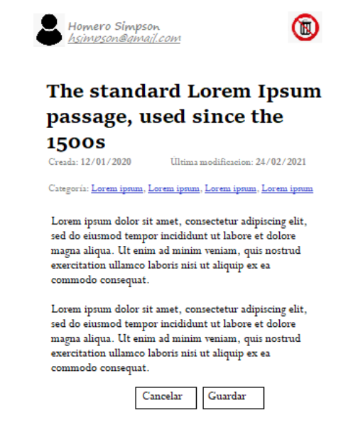

# *DataBase*

## Objetivo
Llegó el momento de prepararnos para evaluar algunos conceptos que hemos visto
sobre Base de datos hasta el momento.

## Resumen de entregables:
Crear un repositorio en GitHub para realizar la entrega que incluya:
- Diagrama de entidad relación.
- Script de SQL.

## Consigna:
Necesitamos diseñar una base de datos relacional para almacenar información sobre un
sistema que administra notas de texto. El interés primario es poder lograr que un usuario
en particular pueda gestionar de cero muchas notas.

En el caso de los usuarios, se necesita registrar el nombre y un e-mail que los identifique.
Además es importante conocer qué nota es la que fue gestionada (creada, modificada y/o
eliminada) por dicho usuario. Ahora bien, una nota solo puede ser gestionada por un
único usuario y para la misma necesitamos registrar un título (el cual no debe superar los
100 caracteres), una fecha de creación, la fecha de la última modificación, una
descripción (es decir, la nota en sí), un mecanismo para identificar si dicha nota puede
ser o no eliminada una vez que sea creada, y por último nos piden que cada nota debe
estar asociada a una o varias categorías, es decir, una categoría puede contener de cero a
muchas notas. Por ejemplo: la categoría música almacenará si existen, todas las notas
que poseen dicha categoría.

- Diagrama de entidad relación

En el DER debemos señalar las tablas con los atributos que son clave primaria y los que son
clave foránea. Además, por cada atributo debemos especificar si aceptan nulos o no y qué
tipo de dato pueden almacenar. Es importante que no nos olvidemos de representar qué
relación y la cardinalidad que existe entre las diferentes tablas de la base de datos para la
administración de las notas.

- Script de SQL

Nuestro script debe crear por completo la base de datos para la administración de las notas,
así como también generar por cada tabla 10 registros con datos de prueba.

## Entrega y corrección:
Para la entrega del trabajo se deberá crear un repositorio en GitHub donde se subirá el
archivo con la imagen del DER (se puede usar draw.io) y el archivo .sql que contenga el
script de creación y llenado de las tablas que se requieren.

En caso de necesitar explicar algo del trabajo entregado, se podrá agregar un archivo
README.md con dicha explicación.

En GitHub debe figurar como última modificación y/o creación una fecha menor o igual a la
fecha límite a la entrega del mismo. En caso contrario, se evaluará como entrega en
segunda instancia.

La corrección será evaluada por el docente a cargo del curso.
¡Muchos éxitos y recordemos que mientras más practicamos más aprendemos!
😎👍✨